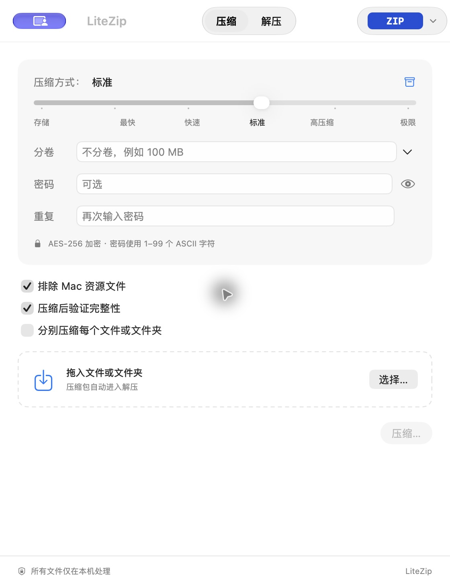
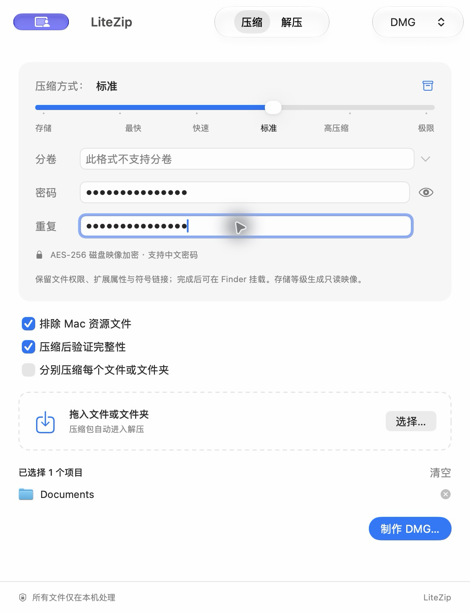
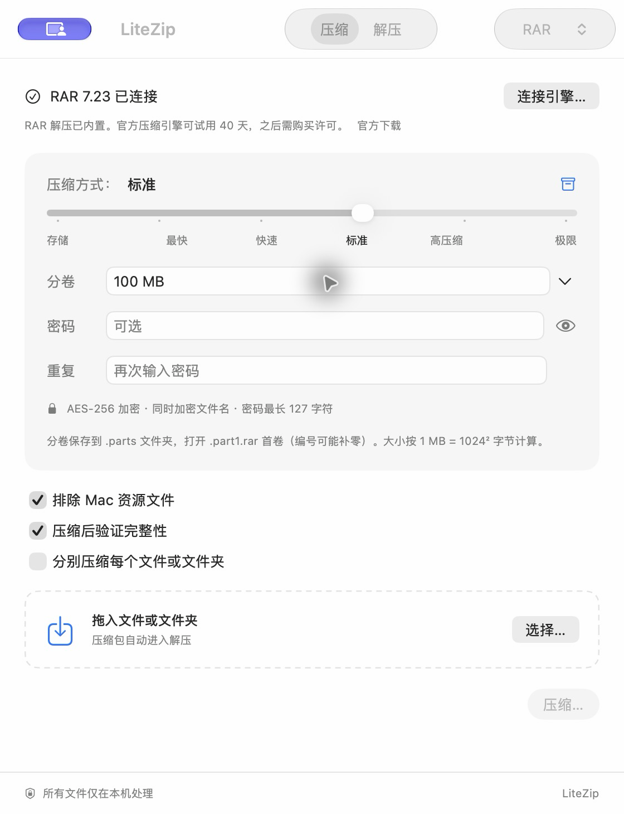

# LiteZip

轻量、原生、免费开源的 macOS 压缩与解压工具。SwiftUI 界面，文件完全在本机处理，无账号、广告或遥测。

**0.4.0 开发预览版 · macOS 13+ · Apple Silicon / Intel 通用构建**



[深色预览](docs/screenshots/dark.png)

## 已实现

- ZIP / 7Z / TAR / TAR.GZ / TAR.BZ2 / TAR.XZ / TAR.ZST 压缩与解压；GZIP / BZIP2 / XZ / ZSTD 单文件压缩与解压。
- ZIPX 解压、预览与校验（已验证 LZMA、BZIP2；其他方法取决于内置引擎）。
- DMG 制作、AES-256 加密、只读预览、完整性校验与 Finder 挂载；保留权限、扩展属性和符号链接。
- RAR / RAR5 解压已内置；连接本机官方 RAR 引擎后支持 RAR 创建、加密与分卷。
- ZIP AES-256 加密、7Z AES 加密及文件名加密；密码仅在内存中使用，通过引擎标准输入传递。
- 紧凑设置面板、标题栏格式选择、带刻度的压缩等级，ZIP／7Z／RAR／DMG 可选择仅存储。
- 密码确认、显示／隐藏、输入校验；提交任务后清空密码与确认字段。
- ZIP／7Z／RAR 分卷（1 MB–1 TB），预设与自定义大小；整组保存到独立 .parts 文件夹，再一次性发布。
- 排除 .DS_Store／._ AppleDouble／__MACOSX；默认保留其他隐藏文件。
- 分别压缩每个文件或文件夹，支持与加密、分卷组合使用。
- 默认压缩后校验完整性；即使关闭数据校验，仍检查目录安全性。
- 文件与文件夹拖放、Dock 拖放与文件打开、混合选择的操作确认。
- 最多两个并行任务、排队、进度、估算速度与剩余时间、取消和重新选择重试。
- 压缩包目录浏览、搜索、完整性校验。
- Finder 扩展：快速压缩、压缩设置、解压到独立文件夹。
- 跟随系统／浅色／深色主题、键盘快捷键、标准文件选择和保存对话框。
- 独立解压文件夹、同名自动编号、原子发布、失败与取消清理。
- 越界路径／重复路径／链接／特殊文件拒绝、磁盘容量预检、展开大小限制。
- 崩溃临时目录的本地登记与后续启动清理：超过一天且所属进程已退出的目录才会清理。

## 使用

打开 LiteZip，先设置格式、压缩等级、密码与分卷，拖入文件后点击“压缩…”。勾选“分别压缩”时选择一个保存目录，每个项目生成独立结果。拖入压缩包会切换到解压；双击由 LiteZip 打开的压缩包会直接解压到同级的独立文件夹。

ZIP／7Z 分卷命名为 `name.zip.001` 或 `name.7z.001`；RAR 分卷为 `name.part1.rar`，较多分卷时编号可能补零。所有分卷需在同一目录，打开第一卷即可预览、校验或解压，选择后续卷会归一到首卷，多个分卷合并为一个任务。兼容读取旧式 ZIP `name.z01` + `name.zip` 与 RAR `name.rar` + `name.r00` + `name.r01`。旧式 ZIP 的目录在最后的 `.zip` 文件里，需保留它。创建 ZIP 仍采用 7-Zip `.001` 编号方式。输入 `100 MB`、`1.5 GB` 或直接输入 MB 数值；单位按 1024 换算。

[下载 0.4.0 开发预览版](https://github.com/gentpan/LiteZip/releases/tag/v0.4.0) · [更新记录](CHANGELOG.md)

### 使用 DMG

选择 DMG 后可制作压缩只读磁盘映像；存储等级生成不压缩的只读映像。密码采用 AES-256，支持中文。文件先复制到私有快照，源文件保留；权限、扩展属性和符号链接随映像保留，链接目标不会被跟随复制。独立 AppleDouble 文件按系统磁盘映像复制规则处理；真实资源分叉与扩展属性保留。

拖入 DMG 可预览内容、搜索与校验。预览在私有临时位置只读挂载，结束后卸载；“在 Finder 打开”交给 macOS DiskImageMounter，挂载加密映像时系统会再次询问密码。DMG 不走普通压缩包的逐文件解压流程，便于保留 `.app` 包结构。多卷映像、稀疏映像与 ISO 制作暂未支持。



[加密 DMG 内容预览](docs/screenshots/dmg-preview.png)

### 创建 RAR

1. 从 [RARLAB 官方下载页](https://www.rarlab.com/download.htm) 获取 macOS RAR 7 或更新版本的软件包，按 Mac 芯片选择 ARM 或 x64，并解包到固定位置。
2. 在 LiteZip 中选择 RAR，点击“连接引擎…”，或在设置中选择软件包内的 `rar` 可执行文件。请保留完整官方软件包；LiteZip 只记住本机路径，不复制引擎或注册密钥。
3. 选择文件，按需设置密码、分卷和压缩等级。RAR 使用 AES-256，同时加密文件名，支持中文密码；最长 127 字符，部分 Emoji 占两个字符。

也会自动查找 `/opt/homebrew/bin/rar`、`/usr/local/bin/rar`、`/opt/local/bin/rar`。不提供自动下载、注册或购买流程。RAR 引擎可试用最多 40 天，之后需要购买许可；未经书面许可不能随其他软件打包分发，见 [官方许可](https://www.rarlab.com/license.htm)。LiteZip 的开源许可不替代 RAR 的许可。**RAR 解压、预览和校验无需该外部引擎。**



应用不会主动改变默认文件关联。可以在 Finder 的“显示简介 → 打开方式”中选择 LiteZip。

Finder 右键菜单需要在系统设置的扩展中启用 **LiteZip Finder**。扩展监视用户主目录和 `/Volumes`。系统设置入口随 macOS 版本不同，可搜索“Finder 扩展”。

ZIP 加密密码当前支持 **1–99 个 ASCII 字符**。中文、Emoji 和更长密码请使用 7Z。AES ZIP 需要兼容 AES 的解压工具，macOS 系统归档工具不一定能打开。

## 构建与测试

需要完整 Xcode（Swift 6+）和 XcodeGen：

```sh
brew install xcodegen
swift test
Scripts/build.sh
open build/LiteZip.app
```

可直接打开提交的 `LiteZip.xcodeproj`。核心是独立的 `LiteZipCore` Swift Package。内置引擎已随源代码提供，最终用户无需 Homebrew。

```sh
LITEZIP_LARGE_TESTS=1 swift test  # 包括真实 1 GiB 文件的流式往返，需可用磁盘空间
LITEZIP_RAR_TEST_ENGINE='/absolute/path/to/rar' swift test  # 可选官方 RAR 集成测试
```

## 签名与公证

发布的 **0.4.0 已完成 Developer ID 签名与 Apple 公证**，ZIP 内的 App 已附上公证凭据。重新解包后，签名、公证凭据和 Gatekeeper 检查均通过。公证用于从 GitHub 等渠道分发，不代表上架 Mac App Store。

本机发布只需构建后执行签名脚本；它会自动提交公证、附上凭据、验证并打包：

```sh
Scripts/build.sh
Scripts/sign.sh
```

本机只有一个有效的 Developer ID Application 签名身份时自动选择；多个身份时需明确指定。公证默认复用维护者现有的 `GiantAccel` Keychain 配置。其他开发者需设置自己的证书和已保存的公证配置：

```sh
export LITEZIP_SIGN_IDENTITY='Developer ID Application: Your Name (TEAMID)'
export LITEZIP_NOTARY_PROFILE='your-saved-keychain-profile'
Scripts/sign.sh
```

签名脚本依次签名内置引擎、Finder 扩展和 App，启用 Hardened Runtime 和安全时间戳。只有 Apple 返回 `Accepted`、公证凭据验证成功、完整签名与 Gatekeeper 检查通过后，才替换 `dist` 中的最终 ZIP 与 SHA-256 校验值。版本号从 App 读取；可用 `LITEZIP_DIST_DIR` 指定输出目录。证书、私钥和账号授权只从本机 Keychain 调用，不进入仓库。

两个脚本都可以指定 App 路径；已有有效 Developer ID 签名的 App 可以直接公证。公证在私有副本上进行，最终 ZIP 包含附上凭据的 App。提交编号、Apple 检查日志和副本保留在输出目录的 `.notarize-*` 目录，失败不会替换已有下载包：

```sh
Scripts/notarize.sh /absolute/path/to/LiteZip.app
```

公证需要 Apple Developer Program 账号授权；已有有效配置可以复用，不需为每个 App 单独注册公证。首次配置参考 [Apple 公证工作流](https://developer.apple.com/documentation/security/customizing-the-notarization-workflow)，使用 `notarytool store-credentials` 保存到 Keychain，不把密码写入脚本。

GitHub Actions 的构建产物为未签名开发构建，Release 下载包为签名及公证后的版本。

## 实现与边界

解压由内置 7-Zip 输出文件字节流，由 LiteZip 在私有临时目录内写入普通文件。引擎不能指定任意落盘路径。每个文件使用独占创建与 `O_NOFOLLOW`，成功后采用不覆盖的原子重命名。分卷集先检查连续编号和普通文件类型，拒绝链接分卷。TAR.GZ 等压缩 TAR 的预览会在本机临时展开外层，再读取内部目录，并遵守相同大小和路径限制。

这版优先验证安全性。逐文件解压对包含很多文件或采用 Solid 压缩的 7Z 速度较慢，尚未完成 10–100 GB 或 10 万文件性能验收。7-Zip 文本目录不能安全表达的换行文件名或多行元数据会被拒绝。BZIP2 等无法提前获取展开大小的格式会在实际写入时限额，进度为不定进度。

主应用是 Developer ID 分发版本，**未启用 App Sandbox**；Finder 扩展启用 Sandbox。尚未实现 Mac App Store 的完整 security-scoped bookmark 权限流程。

普通归档的 macOS 资源分叉、扩展属性、权限和时间戳的完整保留尚未保证。普通归档的符号链接与硬链接暂时拒绝；DMG 制作和预览可保留符号链接，使用系统挂载读取。解压总是建立独立文件夹；不提供原地覆盖或删除源文件。

RAR 创建采用私有源文件快照，避免官方引擎把 `*` 等文件名当作通配符扩大选取范围。APFS 使用文件克隆，其他文件系统采用可取消的分块复制，因此按源大小的两倍预检可用空间。同一 RAR 的顶层项目不能同名；此时可分别压缩，或先重命名。

详见 [技术决策与路线图](docs/DEVELOPMENT.md) 和 [验证记录](docs/VALIDATION.md)。

## License

LiteZip 自有代码为 MIT。内置 7-Zip 按 LGPL 和 unRAR 限制分发，Zstandard 使用 BSD 许可；测试用 RAR 样本来自 libarchive。对应许可、版本、来源和构建说明见 [Vendor](Vendor/README.md) 与 [ThirdPartyNotices](Resources/ThirdPartyNotices.txt)。
